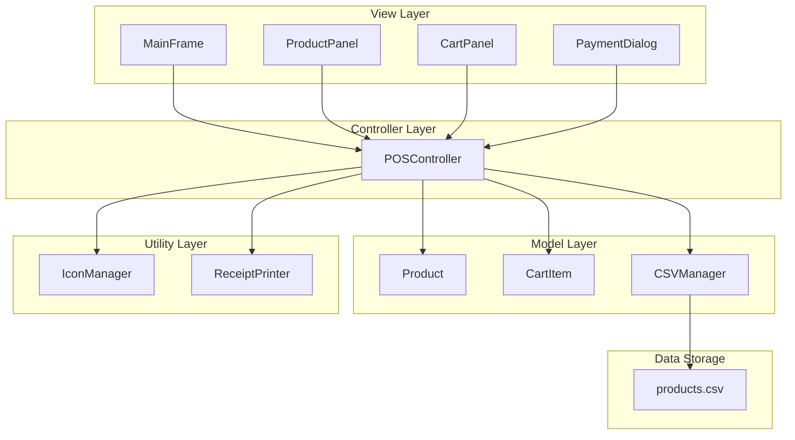
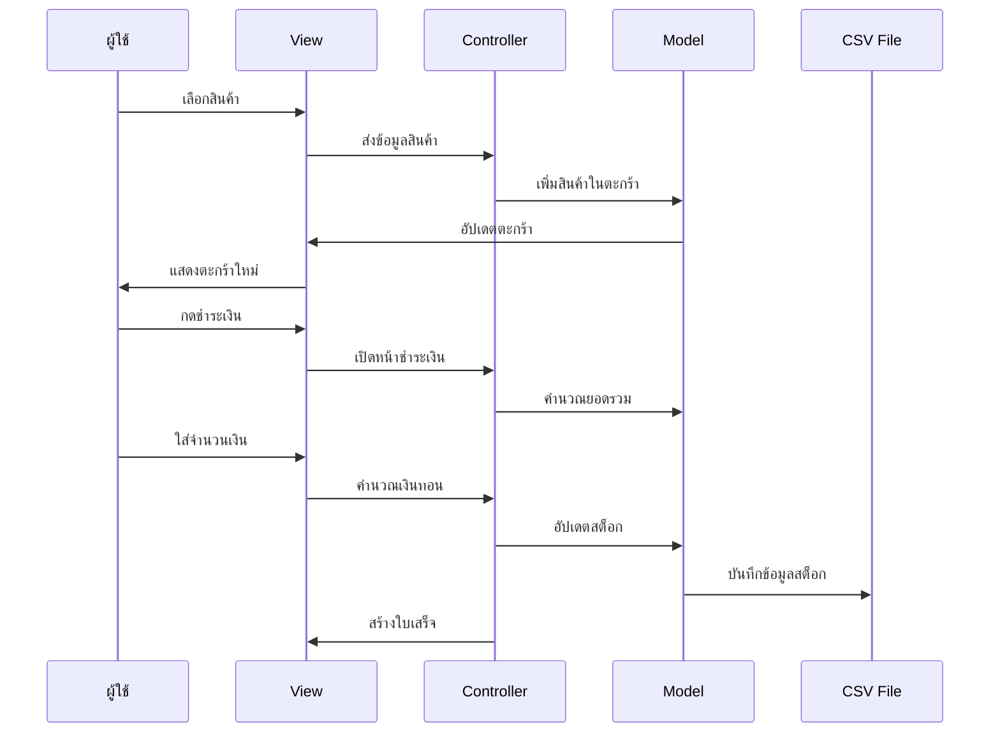
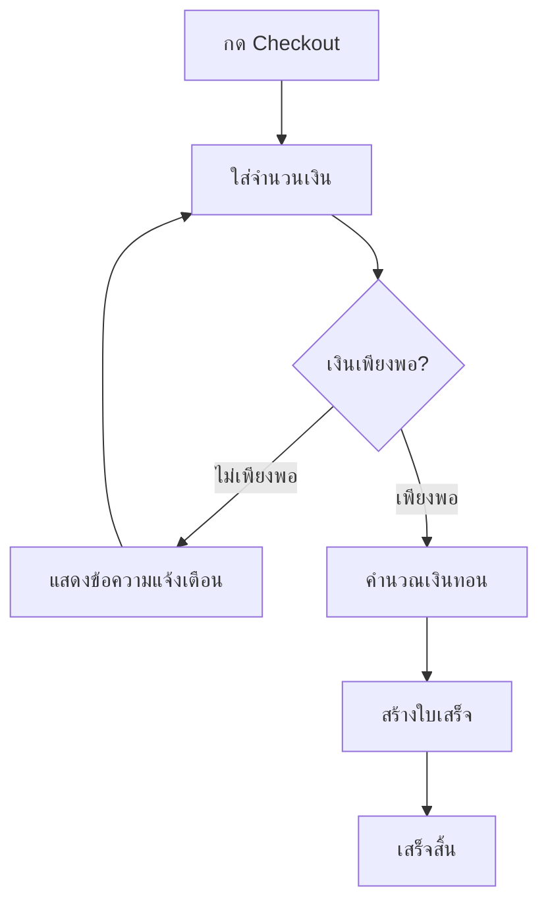
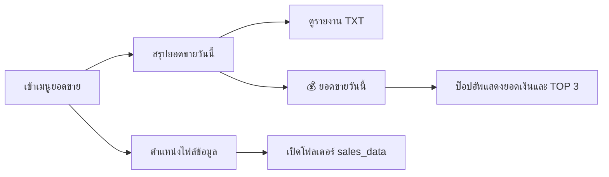
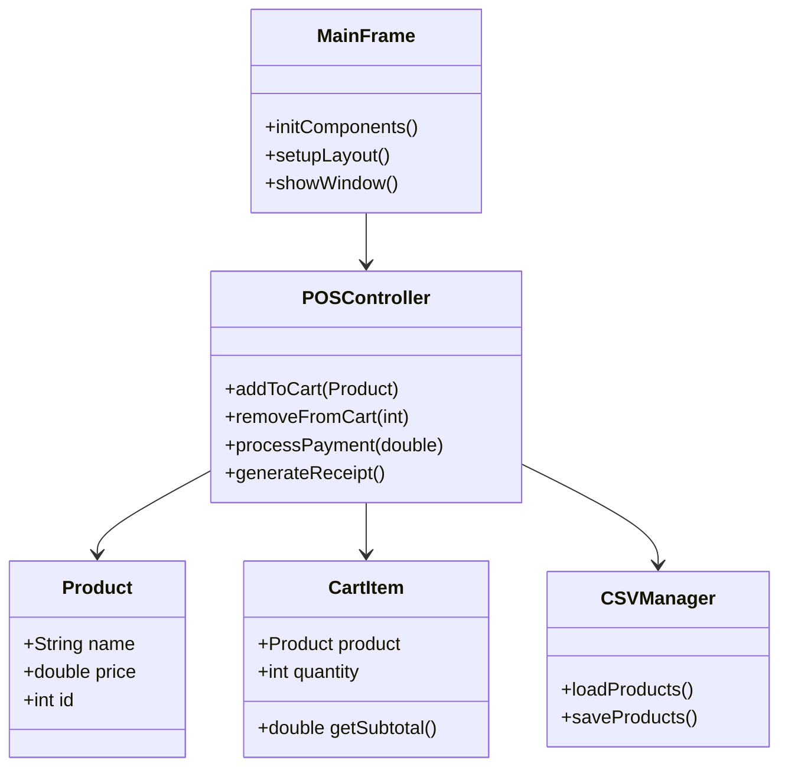

ชื่อสมาชิก
1. ศิลา บำรุงพันธุ์ 6752300372
2. แฟร้งค์ ลอเรนซ์ เมอร์คาโด 6752300771
3. กิตติภัทร์ เพ็งน้ำคำ 6752300704


# ระบบจุดขาย Coffee POS System 
## คู่มือการใช้งานและเอกสารนำเสนอ

---

## 📋 สารบัญ
1. [ภาพรวมของระบบ](#ภาพรวมของระบบ)
2. [สถาปัตยกรรมระบบ](#สถาปัตยกรรมระบบ)
3. [คุณสมบัติหลักของระบบ](#คุณสมบัติหลักของระบบ)
4. [การติดตั้งและการใช้งาน](#การติดตั้งและการใช้งาน)
5. [คู่มือผู้ใช้งาน](#คู่มือผู้ใช้งาน)
6. [โครงสร้างโค้ดและไฟล์](#โครงสร้างโค้ดและไฟล์)
7. [การพัฒนาต่อยอด](#การพัฒนาต่อยอด)

---

## 🎯 ภาพรวมของระบบ

### วัตถุประสงค์หลัก
ระบบ Coffee POS System เป็นแอปพลิเคชันจุดขายสำหรับร้านกาแฟ พัฒนาด้วยภาษา Java และ Swing GUI Framework เพื่อช่วยให้การขาย การคำนวณเงิน และการพิมพ์ใบเสร็จเป็นไปอย่างมีประสิทธิภาพ

### ปัญหาที่ระบบแก้ไข
- ✅ การคำนวณยอดขายและเงินทอนด้วยมือ
- ✅ การจัดการสินค้าและสต็อกที่ไม่มีประสิทธิภาพ
- ✅ ขาดหน้าจอที่ทันสมัยและใช้งานง่าย
- ✅ ไม่มีระบบสร้างใบเสร็จอัตโนมัติ

### ประโยชน์หลัก
- 🚀 เพิ่มความเร็วในการขาย
- 💰 ลดข้อผิดพลาดในการคำนวณ
- 📊 จัดการสินค้าได้อย่างเป็นระบบ
- 🧾 สร้างใบเสร็จแบบมืออาชีพ

---

## 🏗️ สถาปัตยกรรมระบบ

### แผนผังสถาปัตยกรรม MVC


### การทำงานของระบบ


---

## ⭐ คุณสมบัติหลักของระบบ

### 1. การจัดการสินค้า (Product Management)
- 📋 รองรับเมนูกาแฟและเบเกอรี่มากกว่า 24 รายการ
- 🎨 ปุ่มสินค้าขนาดใหญ่พร้อมอีโมจิ
- 💾 จัดเก็บข้อมูลในไฟล์ CSV
- 📊 ระบบติดตามสต็อกสินค้า

### 2. ตะกร้าสินค้า (Shopping Cart)
- ➕ เพิ่มสินค้าได้หลายชิ้น
- ❌ ลบสินค้าออกจากตะกร้า
- 🔄 ปรับจำนวนสินค้าได้
- 💰 คำนวณยอดรวมแบบเรียลไทม์

### 3. ระบบชำระเงิน (Payment System)
- 💵 คำนวณเงินทอนอัตโนมัติ
- ⚡ ปุ่มจำนวนเงินด่วน
- ✅ ตรวจสอบจำนวนเงินที่ไม่เพียงพอ
- 🎨 แสดงผลด้วยสีที่แตกต่างกัน

### 4. ใบเสร็จ (Receipt System)
- 👀 ดูตัวอย่างใบเสร็จ
- 💾 บันทึกใบเสร็จ
- 🖨️ พิมพ์ใบเสร็จ
- ℹ️ ข้อมูลร้าน รายการสินค้า และเวลา

### 5. ระบบชำระเงิน (Payment System)
- 💵 คำนวณเงินทอนอัตโนมัติ
- ⚡ ปุ่มจำนวนเงินด่วน
- ✅ ตรวจสอบจำนวนเงินที่ไม่เพียงพอ
- 🎨 แสดงผลด้วยสีที่แตกต่างกัน
- 📱 หน้าต่างการชำระเงินขนาดกะทัดรัด

### 6. ระบบติดตามยอดขาย (Sales Tracking)
- 📊 บันทึกยอดขายอัตโนมัติทุกครั้งที่ชำระเงิน
- 📄 สร้างรายงานสรุปยอดขายรายวัน
- 📈 แสดงสินค้าขายดี TOP 3
- 💾 เก็บข้อมูลเป็นไฟล์ TXT ใน folder sales_data
- 🔢 นับจำนวนแก้วที่ขายได้แต่ละรายการ
- 📋 รายงานรายได้รวมและยอดเฉลี่ยต่อธุรกรรม
- 💰 ปุ่มคำนวณยอดขายด่วนในหน้าสรุปยอดขาย

### 7. การปรับปรุง UI/UX 🔄
- 🖼️ แก้ไขปัญหาการแสดงราคาสินค้าในการ์ด
- 📏 ปรับขนาดปุ่มสินค้าให้เหมาะสม (170px สูง)
- 🎨 ปรับ HTML padding และ font size ให้เหมาะสม
- 📱 ปรับขนาดหน้าต่างชำระเงินให้กะทัดรัด
- 🔧 ปรับปรุงการจัดวางข้อมูลในหน้าชำระเงิน

---

## 💻 การติดตั้งและการใช้งาน

### ความต้องการของระบบ
- **ภาษา**: Java JDK 8 หรือสูงกว่า
- **ระบบปฏิบัติการ**: Windows, macOS, หรือ Linux
- **หน่วยความจำ**: 512 MB RAM
- **พื้นที่จัดเก็บ**: 50 MB

### ขั้นตอนการติดตั้ง

#### 1. ตรวจสอบ Java
```bash
java -version
javac -version
```

#### 2. คอมไพล์โปรแกรม
```bash
cd src
javac -d . view/MainFrame.java
```

#### 3. รันโปรแกรม
```bash
java view.MainFrame
```

### ไฟล์ที่จำเป็น
```
POS/
├── src/
│   ├── controller/
│   ├── model/
│   ├── util/
│   ├── view/
│   └── Main.java
└── products.csv
```

---

## 👨‍💼 คู่มือผู้ใช้งาน

### ขั้นตอนการขาย

#### 1. เลือกสินค้า


#### 2. จัดการตะกร้า
- ✅ เพิ่มสินค้าเดียวกันหลายชิ้น
- ❌ ลบสินค้าด้วยปุ่ม Delete
- 👁️ ดูยอดรวมแบบเรียลไทม์

#### 3. ชำระเงิน


#### 4. จัดการใบเสร็จ
- 👀 **Preview**: ดูตัวอย่างใบเสร็จ
- 💾 **Save**: บันทึกเป็นไฟล์
- 🖨️ **Print**: พิมพ์ใบเสร็จ

#### 5. ระบบชำระเงิน 💳
- กรอกจำนวนเงินที่ได้รับ
- แสดงยอดรวมทั้งหมด
- คำนวณเงินทอนที่ถูกต้อง
- สีของข้อความเงินทอนจะเปลี่ยนตามจำนวน (เขียว=เพียงพอ, แดง=ไม่เพียงพอ)

#### 6. ดูรายงานยอดขาย 📊


**ขั้นตอนการดูรายงาน:**
1. ไปที่เมนูบาร์ เลือก "📊 ยอดขาย"
2. เลือก "📄 สรุปยอดขายวันนี้" สำหรับเปิดหน้าต่างรายงาน
3. กดปุ่ม "💰 ยอดขายวันนี้" เพื่อดูยอดขายด่วน
4. เลือก "📁 ตำแหน่งไฟล์ข้อมูล" เพื่อดูที่อยู่ไฟล์

**ฟีเจอร์ใหม่ - ยอดขายด่วน:**
- กดปุ่มเดียวดูยอดขายวันนี้
- แสดงยอดรวมเงินที่ได้รับ
- แสดงสินค้าขายดี TOP 3 พร้อมจำนวน
- ป๊อปอัพขึ้นทันที ไม่ต้องเปิดไฟล์

**โครงสร้างไฟล์ข้อมูล:**
```
POS/
├── sales_data/
│   ├─รายละเอียดการขาย: daily_sales_2024-08-24.txt
│   └─สรุปยอดขาย: sales_summary_2024-08-24.txt
└── src/
```

### ตัวอย่างใบเสร็จ (ปรับปรุงใหม่)
```
==================================================
                Coffee POS Store
             Nonthaburi, Thailand
             Tel: +66 640-297-030
         Kittiphatphengnamkham@gmail.com
==================================================
                 SALES RECEIPT
==================================================
Date: 25/08/2024 14:30:25
Receipt#: POS12345
--------------------------------------------------
Item                 Qty    Price       Total
--------------------------------------------------
Americano              1    65.00       65.00
Cappuccino             2    75.00      150.00
Croissant              1    45.00       45.00
--------------------------------------------------
Total Items: 4
TOTAL: ฿260.00
--------------------------------------------------
Cash Received: ฿300.00
Change: ฿40.00
==================================================
           Thank You for Your Purchase!
              Have a Great Day!
             Visit us again soon!
==================================================
    ** This is a computer generated receipt **
              No signature required
```

---

## 🗂️ โครงสร้างโค้ดและไฟล์

### โครงสร้างหลัก
```
src/
├── controller/
│   └── POSController.java      # ควบคุมการทำงานหลัก
├── model/
│   ├── Product.java           # โมเดลสินค้า
│   ├── CartItem.java          # โมเดลสินค้าในตะกร้า
│   ├── CSVManager.java        # จัดการไฟล์ CSV
│   └── Sale.java              # โมเดลข้อมูลการขาย 🆕
├── view/
│   ├── MainFrame.java         # หน้าจอหลัก
│   ├── ProductPanel.java      # แผงแสดงสินค้า
│   ├── CartPanel.java         # แผงตะกร้าสินค้า
│   └── PaymentDialog.java     # หน้าต่างชำระเงิน
├── util/
│   ├── IconManager.java       # จัดการไอคอนและสี
│   ├── ReceiptPrinter.java    # พิมพ์ใบเสร็จ
│   └── SalesTracker.java      # ติดตามและบันทึกยอดขาย 🆕
└── Main.java                  # ไฟล์หลักรันโปรแกรม
```

### ไฟล์ข้อมูล
- **products.csv**: เก็บข้อมูลสินค้า ราคา 

### แผนผังการทำงานของ Classes


---

## 🚀 การพัฒนาต่อยอด

### คุณสมบัติที่วางแผนไว้
- 🗄️ **ฐานข้อมูล**: เปลี่ยนจาก CSV เป็น MySQL/SQLite
- 👥 **Multi-user**: รองรับผู้ใช้หลายคน
- 🌐 **เครือข่าย**: เชื่อมต่อสาขาต่างๆ
- 🖨️ **เครื่องพิมพ์ใบเสร็จ**: รองรับ Thermal Printer
- 🔐 **ระบบความปลอดภัย**: Login และสิทธิ์การใช้งาน
- 📱 **Mobile App**: แอปมือถือสำหรับลูกค้า
- 📊 **รายงาน**: สรุปยอดขายและสต็อก

### ข้อจำกัดปัจจุบัน
- ⚠️ ใช้ CSV แทนฐานข้อมูล
- ⚠️ ไม่รองรับหลายผู้ใช้พร้อมกัน
- ⚠️ ไม่มีระบบสำรองข้อมูล
- ⚠️ ไม่มีการตรวจสอบข้อมูลนำเข้า

### แนวทางการปรับปรุง
1. **ปรับปรุงฐานข้อมูล**: ย้ายจาก CSV ไป Database
2. **เพิ่มการตรวจสอบ**: ใส่ validation และ error handling
3. **ปรับปรุง UI/UX**: ทำให้ใช้งานง่ายขึ้น
4. **เพิ่มรายงาน**: สถิติการขายและการจัดการสต็อก

---

## 📞 ข้อมูลติดต่อและการสนับสนุน

### การแก้ไขปัญหาเบื้องต้น

#### ปัญหาที่พบบ่อย
1. **Java ไม่ทำงาน**: ตรวจสอบการติดตั้ง JDK
2. **ไม่พบไฟล์ CSV**: สร้างไฟล์ products.csv ใหม่
3. **ข้อผิดพลาดในการคำนวณ**: ตรวจสอบรูปแบบข้อมูลใน CSV
4. **ราคาสินค้าไม่แสดงในการ์ด**: ✅ แก้ไขแล้ว - ปรับขนาดและ padding
5. **เงินทอนคำนวณถูกต้อง**: ✅ แก้ไขแล้ว - ระบบคำนวณที่สม่ำเสมอ
6. **หน้าชำระเงินขนาดเหมาะสม**: ✅ แก้ไขแล้ว - ปรับขนาดให้กะทัดรัด

#### การปรับปรุงล่าสุด (v1.2) 🆕
- ✅ แก้ไขการแสดงผลราคาสินค้าในปุ่ม
- ✅ ลบระบบ VAT 7% ตามความต้องการ
- ✅ ปรับปรุงความสม่ำเสมอของการคำนวณเงินทอน
- ✅ เพิ่มปุ่มยอดขายด่วนในหน้าสรุปยอดขาย
- ✅ ปรับปรุง UI ให้แสดงผลชัดเจนขึ้น

#### การสำรองข้อมูล
- สำรองไฟล์ `products.csv` เป็นประจำ
- เก็บสำเนาโค้ดใน Version Control System

---

## 🎉 สรุป

ระบบ Coffee POS System เป็นโซลูชันที่สมบูรณ์สำหรับร้านกาแฟขนาดเล็กถึงกลาง ด้วยการออกแบบที่เน้นความง่ายในการใช้งานและประสิทธิภาพ ระบบนี้จะช่วยปรับปรุงกระบวนการขายและการจัดการร้านของคุณให้ดีขึ้นอย่างมีนัยสำคัญ

### จุดเด่นหลัก
- ✅ ใช้งานง่าย เรียนรู้เร็ว
- ✅ ประสิทธิภาพสูง ประหยัดเวลา
- ✅ ปรับแต่งได้ ขยายงานได้
- ✅ ต้นทุนต่ำ ผลตอบแทนสูง
- ✅ ระบบคำนวณที่ถูกต้องแม่นยำ
- ✅ รายงานยอดขายแบบเรียลไทม์
- ✅ UI ที่สวยงาม ใช้งานสะดวก

### อัปเดตล่าสุด (v1.2 - August 2024)
🔧 **การแก้ไขบัค:**
- ราคาสินค้าแสดงผลครบถ้วนในการ์ด
- เงินทอนคำนวณถูกต้องทั้งระบบ
- หน้าชำระเงินแสดงข้อมูลครบถ้วน

⭐ **ฟีเจอร์ปรับปรุง:**
- ลบระบบ VAT 7% ตามความต้องการ
- ปุ่มยอดขายด่วนในหน้าสรุป
- การรายงานที่ปรับปรุงใหม่

- ## 📞 การติดต่อ
หากพบปัญหาหรือต้องการสอบถามเพิ่มเติม สามารถติดต่อได้ที่:
- Email: kittiphatphengnamkham34@gmail.com
- GitHub :(https://github.com/KPkittiphat/Coffee-Pos-System)

พร้อมสำหรับการใช้งานจริงและการพัฒนาต่อยอดในอนาคต! ☕️✨
